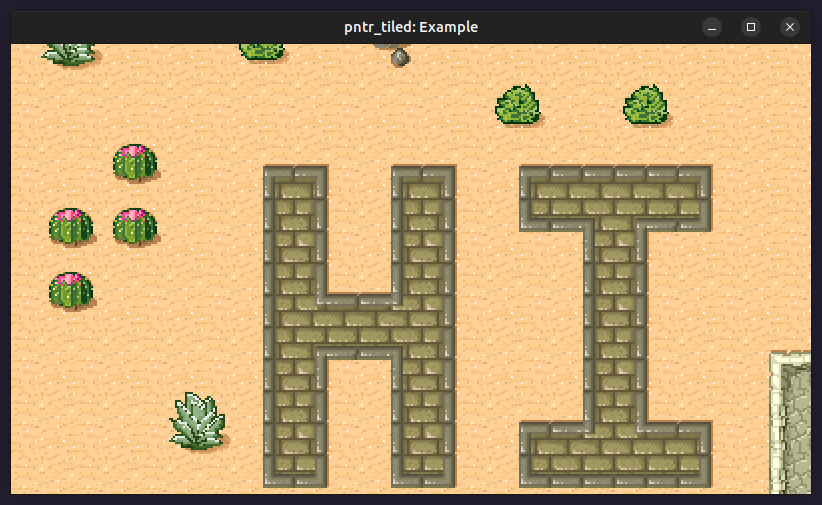

# pntr_tiled

Use [Tiled](https://www.mapeditor.org) maps in [pntr](https://github.com/RobLoach/pntr), with [cute_tiled](https://github.com/RandyGaul/cute_headers/blob/master/cute_tiled.h).



## Usage

``` c
#define PNTR_TILED_IMPLEMENTATION
#include "pntr_tiled.h"

int main() {
    // Load the Tiled JSON file
    cute_tiled_map_t* map = pntr_load_tiled("mymap.json");

    // Generate an image of the Tiled map
    pntr_image* image = pntr_gen_image_tiled(map, PNTR_WHITE);

    // Save the image as a PNG
    pntr_save_image(image, "world.png");

    return 0;
}
```

### Features

- [x] Tile Layers
- [x] Image Layers
- [x] Group Layers
- [ ] Object Layers
- [x] Animated Tiles
- [x] Flipped/Rotated Tiles

### API

``` c
cute_tiled_map_t* pntr_load_tiled(const char* fileName);
cute_tiled_map_t* pntr_load_tiled_from_memory(const unsigned char *fileData, unsigned int dataSize, const char* baseDir);
void pntr_unload_tiled(cute_tiled_map_t* map);
void pntr_draw_tiled(pntr_image* dst, cute_tiled_map_t* map, int posX, int posY, pntr_color tint);
void pntr_draw_tiled_tile(pntr_image* dst, cute_tiled_map_t* map, int gid, int posX, int posY, pntr_color tint);
void pntr_draw_tiled_layer_imagelayer(pntr_image* dst, cute_tiled_map_t* map, cute_tiled_layer_t* layer, int posX, int posY, pntr_color tint);
void pntr_draw_tiled_layer_tilelayer(pntr_image* dst, cute_tiled_map_t* map, cute_tiled_layer_t* layer, int posX, int posY, pntr_color tint);
pntr_image* pntr_tiled_tile_image(cute_tiled_map_t* map, int gid);
pntr_image* pntr_gen_image_tiled(cute_tiled_map_t* map, pntr_color tint);
void pntr_update_tiled(cute_tiled_map_t* map, float deltaTime);
cute_tiled_layer_t* pntr_tiled_layer(cute_tiled_map_t* map, const char* name);
int pntr_layer_tile(cute_tiled_layer_t* layer, int column, int row);
void pntr_set_layer_tile(cute_tiled_layer_t* layer, int column, int row, int gid);
pntr_vector pntr_layer_tile_from_position(cute_tiled_map_t* map, cute_tiled_layer_t* layer, int posX, int posY);
cute_tiled_map_t* pntr_load_tiled_from_assetsys(assetsys_t* sys, const char* fileName);
```

## License

Unless stated otherwise, all works are:

- Copyright (c) 2023 [Rob Loach](https://robloach.net)

... and licensed under:

- [zlib License](LICENSE)
